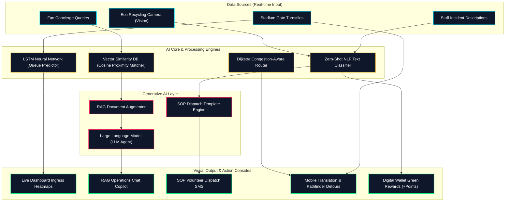
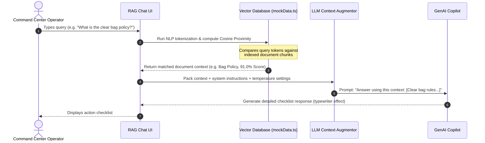
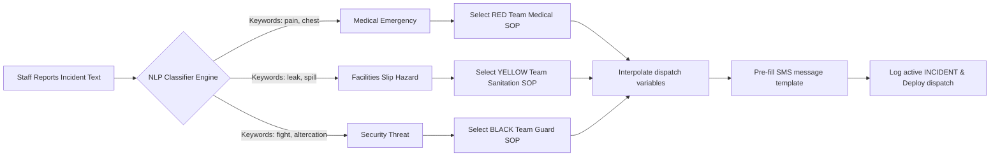

# 🏟️ Pulse2026: GenAI Stadium Operations & Fan Experience Platform

Pulse2026 is a premium, real-time stadium operations and fan experience platform designed for the **FIFA World Cup 2026**. The platform utilizes simulated Generative AI, RAG (Retrieval-Augmented Generation), Zero-Shot Classification, and LSTM time-series forecasting to optimize venue logistics, route crowds, respond to incidents, and assist fans.

---

## 🗺️ System Architecture Diagram

This diagram visualizes how raw inputs flow through our AI engines, get augmented by the LLM layer, and trigger operational outcomes:



---

## ⚡ Core AI Workflows

### 1. Retrieval-Augmented Generation (RAG) Chat Pipeline
How the Operations Copilot answers query questions using semantic context vector indexing:



---

### 2. Zero-Shot Incident Routing & Dispatch Pipeline
How the Safety Log automatically routes medical, facilities, or security reports to the correct SOP responder:



---

## 💎 Features Included

1. **Operations Command Dashboard**:
   - **Spatial Heatmap**: Neon interactive representation of gate ingress nodes.
   - **LSTM Time-Series Forecasts**: Live line graphs predicting wait times 15, 30, and 60 minutes out.
2. **GenAI Operations Command Copilot**:
   - Full RAG chat module detailing similarity indices, vector search metadata, and temperature parameters.
3. **Zero-Shot Incident Dispatcher**:
   - Natural language classification that selects standard operating procedures and formats dispatch alerts.
4. **Mobile Fan Portal Simulator**:
   - **Multilingual Assistant**: Translation into Spanish, Arabic, Portuguese, and French.
   - **Congestion Pathfinder**: Smart routing detours to guide visitors around bottlenecks.
   - **Eco Scan Bounding Boxes**: Simulated Computer Vision that identifies recycling materials and awards points.
5. **AI Diagnostics Engine**:
   - Interactive 2D Vector Space coordinate plotter.
   - Prompt engineering and neural network model tuners.

---

## 🛠️ Technology Stack
* **Framework**: React 19, TypeScript, Vite 8 (relative assets base paths)
* **Styling**: Premium Custom Vanilla CSS (Glassmorphism, custom CSS variables, keyframe animations)
* **Icons**: Lucide React
* **Deployment**: GitHub Pages (Legacy build-branch strategy)

---

## 🚀 Running Locally

1. Install package dependencies:
   ```bash
   npm install
   ```
2. Run development server:
   ```bash
   npm run dev
   ```
3. Build production assets:
   ```bash
   npm run build
   ```
